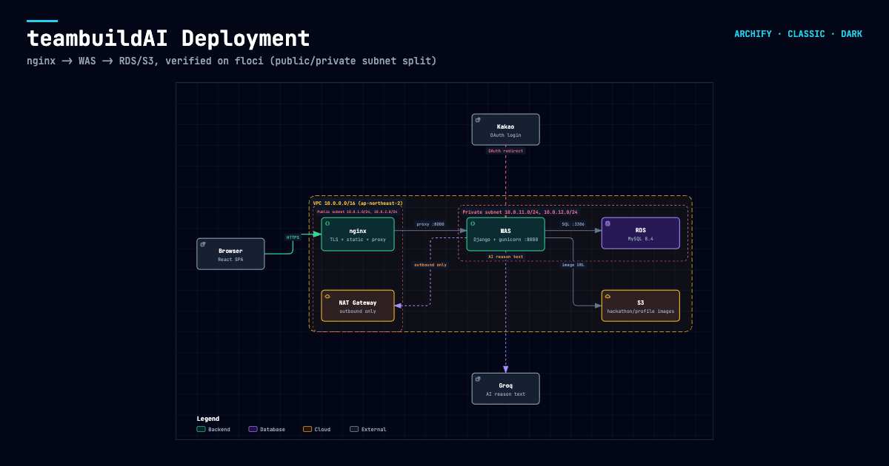

# teambuildAI

> **파비콘** — 가장 잘 맞는 팀원과 연결되는 순간
  
해커톤에 나가고 싶지만 **함께할 팀원이 없어 망설이는 대학생**을 위한 AI 기반 팀 매칭 플랫폼입니다.
  
  
## 목차  
  
- [배경](#배경)  
- [주요 기능](#주요-기능)  
- [기술 스택](#기술-스택)  
- [프로젝트 구조](#프로젝트-구조)  
- [시작하기](#시작하기)  
- [인프라 / 배포](#인프라--배포)  
- [테스트 방법](./QA.md)  
- [팀](#팀)  
  
  
  
## 배경  
  
해커톤 참가는 학생에게, 현직자에게 있어서 자신의 실력을 확인하고 다양한 목표를 이루기 위한 좋은 경험이나, **참가 목적에 따라 자신에게 맞는 팀원을 구하기 어려운 문제** 때문에 포기하는 경우가 많습니다.
  
기존 구인 게시판(캠퍼스픽, 링커리어 등)은 다음과 같은 한계가 있습니다.  
  
| 문제 | 설명 |  
| --- | --- |  
| **일방향 구조** | 글을 올리고 연락을 기다리는 것 외에 할 수 있는 일이 없음 |  
| **낮은 노출** | 조회수는 있어도 실제 연락으로 이어지지 않음 |  
| **신뢰 부족** | 텍스트 몇 줄로는 상대의 진정성과 역량을 판단할 수 없어 서로 연락을 꺼림 |  
| **낮은 지속성** | 어렵게 연결되어도 성향이 맞지 않아 팀이 와해됨 |  
  
> 해커톤에 나가고 싶지만 나와 맞는 사람을 찾기 어려운 문제, 이 부분에 집중하여 파비콘은 시작되었습니다.  
  
## 주요 기능  

- **해커톤 정보 탐색** — 진행 중인 해커톤 정보를 한곳에서 확인할 수 있습니다.  
- **프로필 기반 매칭** — 보유 스킬, 업무 스타일, 참가 목적 등 정량적 지표에 따라 나에게 맞는 팀원을 선별하고, AI가 추천하는 이유를 설명해줍니다.  
- **자기 소개서 기반 팀원 소개** — 알고리즘과 AI가 추천만 해주는 것이 아닌, 나 스스로가 상대방의 자기소개서를 읽고 판단할 수 있습니다.
- **커피챗 채팅** — 가벼운 어플리케이션 내 채팅으로 상대방에 대해 궁금한 점을 물어볼 수 있습니다.
  
  
## 기술 스택  
  
### Frontend  
  
| 분류 | 기술 | 버전 |  
| --- | --- | --- |  
| 언어 | TypeScript | `^5.7` |  
| 프레임워크 | React | `^19.0` |  
| 빌드 도구 | Vite | `^8.0` |  
| 스타일링 | Tailwind CSS | `^4.0` |  
| 상태/데이터 | 자체 `useQuery` / `useMutation` 훅 + React Context | — |  
| 포맷터 | oxfmt | `^0.2` |  
| 패키지 매니저 | pnpm | `10.34.3` |  
| 런타임 | Node.js | `22` |  
  
> 데이터 페칭은 React Query 등 외부 라이브러리 없이 **자체 훅으로 구현**했습니다. 의존성을 최소화하고 캐싱, 재검증 로직을 프로젝트 요구사항에 맞게 직접 제어하기 위한 선택입니다.  
  
### Backend  
  
| 분류 | 기술 | 버전 |  
| --- | --- | --- |  
| 언어 | Python | `3.14` |  
| 프레임워크 | Django | `^6.0.7` |  
| API 레이어 | Django REST Framework | `^3.18` |  
| API 문서 | drf-spectacular (OpenAPI 3 스키마 자동 생성 + Swagger UI/ReDoc) | `^0.30` |  
| WSGI 서버 | Gunicorn (프로덕션), Django `runserver` (로컬 개발) | `^26.2` |  
| DB 드라이버 | PyMySQL (순수 Python 구현) | `^1.2` |  
| 패키지 매니저 | uv | — |  

> API 문서는 백엔드 실행 후 `/api/docs/`(Swagger UI), `/api/redoc/`(ReDoc), `/api/schema/`(OpenAPI 원본)에서 바로 확인할 수 있습니다.  
  
  
### Database  
  
| 분류 | 내용 |  
| --- | --- |  
| DBMS | MySQL `8.4` (Docker 이미지) |  
| Charset | `utf8mb4` / `utf8mb4_unicode_ci` (한글 및 이모지 지원) |  
  
  
## 프로젝트 구조  
  
```
.
├── frontend/               # React + TypeScript (Vite)
│   ├── src/
│   │   ├── components/     # 공통 UI 컴포넌트
│   │   ├── hooks/          # 자체 useQuery / useMutation 구현
│   │   ├── pages/          # 라우팅 단위 페이지
│   │   ├── contexts/       # 전역 상태 (React Context)
│   │   └── lib/            # API 클라이언트, 유틸리티
│   ├── vite.config.ts      # dev 프록시 설정 (/api, /admin → backend:8000)
│   └── package.json
│
├── backend/                # Django
│   ├── apps/               # 도메인별 앱 (accounts, contests, matching, chat)
│   ├── config/             # settings, urls, wsgi/asgi
│   ├── pyproject.toml      # uv 기반 의존성 관리
│   └── Dockerfile
│
├── docker-compose.yml      # backend + db 구성
└── README.md
```
  
  
## 시작하기  
  
### 요구 사항  
  
- Docker / Docker Compose  
- Node.js `22` 이상  
- pnpm `10.34.3`  
  
### 1. 저장소 클론  
  
```bash
git clone <repository-url>
cd favicon
```
  
### 2. 백엔드 & 데이터베이스 실행  
  
```bash
docker compose up -d
```
  
MySQL 컨테이너와 Django 개발 서버가 함께 기동됩니다.  
DB 데이터는 named volume에 저장되어 컨테이너를 재생성해도 유지됩니다.  
  
```bash
# 마이그레이션
docker compose exec backend uv run python manage.py migrate

# 관리자 계정 생성
docker compose exec backend uv run python manage.py createsuperuser

# 홈 화면에 보여줄 실제 해커톤 6개 심기 (마이그레이션이 아니라 커맨드라 migrate만으론 안 채워짐)
docker compose exec backend uv run python manage.py seed_real_hackathons
```
  
### 3. 프론트엔드 실행  
  
```bash
cd frontend
pnpm install
pnpm dev
```
  
`http://localhost:5173` 에서 접속할 수 있으며, `/api` 와 `/admin` 요청은 Vite 프록시를 통해 `backend:8000` 으로 전달됩니다.
  
### 4. 코드 포맷팅  
  
```bash
pnpm format          # oxfmt
```
  

## 인프라 / 배포

실제 배포를 위한 아키텍처를 [Terraform](https://www.terraform.io/)으로 코드화해뒀습니다 (`infra/terraform/`).



CloudFront 대신 nginx가 TLS 종료 + 정적 파일 서빙 + 리버스 프록시를 전부 담당하고, VPC는 NAT Gateway를 포함한 퍼블릭/프라이빗 서브넷 2계층 구조입니다. WAS(Django + Gunicorn)와 RDS(MySQL 8.4)는 퍼블릭 IP 없이 프라이빗 서브넷에만 위치하며, 이미지는 S3(퍼블릭 읽기 전용)에 저장됩니다.

실제 AWS 비용 없이 검증하고 싶다면 로컬 AWS 에뮬레이터인 [`floci`](https://floci.io)를 띄운 뒤 그대로 `terraform apply`할 수 있습니다 (`infra/terraform/floci_override.tf`가 AWS provider 엔드포인트를 `localhost:4566`으로 바꿔줍니다). 사용법과 설계 배경은 [`infra/terraform/README.md`](./infra/terraform/README.md)를 참고하세요.

## 팀  
  
숭실대학교 SSU-WAY 프로젝트 참여 팀입니다.  
<div> 
  <div style="display: inline-block; text-align: center; margin-right: 15px;">
    <a href="https://github.com/LyleKim" target="_blank">
      
    </a>
    <div style="font-size: 12px; margin-top: 4px;">LyleKim</div>
  </div>
</div>

</div>
  <div style="display: inline-block; text-align: center; margin-right: 15px;">
    <a href="https://github.com/minch-070605" target="_blank">
      
    </a>
    <div style="font-size: 12px; margin-top: 4px;">minch-070605</div>
  </div>
</div>

</div>
  <div style="display: inline-block; text-align: center; margin-right: 15px;">
    <a href="https://github.com/changmin0293" target="_blank">
      
    </a>
    <div style="font-size: 12px; margin-top: 4px;">changmin0293</div>
  </div>
</div>

</div>
  <div style="display: inline-block; text-align: center; margin-right: 15px;">
    <a href="https://github.com/shim75" target="_blank">
      
    </a>
    <div style="font-size: 12px; margin-top: 4px;">shim75</div>
  </div>
</div>

</div>
  <div style="display: inline-block; text-align: center; margin-right: 15px;">
    <div target="_blank">
      
    </div>
    <div style="font-size: 12px; margin-top: 4px;">Claude AI</div>
  </div>  
</div>
<br/>


  
## 라이선스

추후 결정 예정입니다.